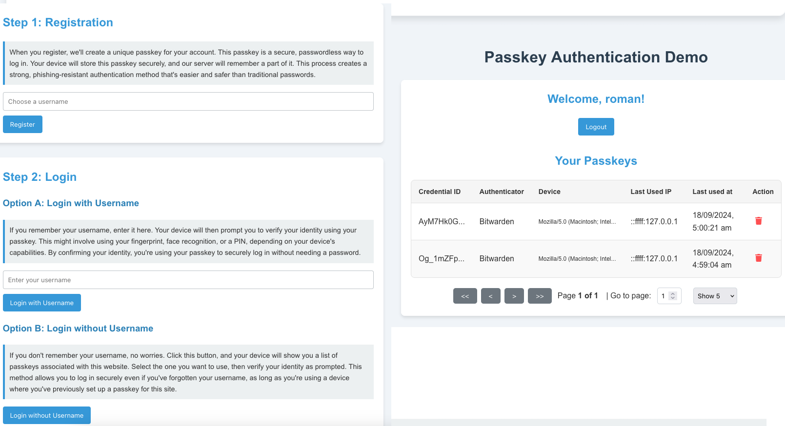

# Passkey Authentication Demo

This project demonstrates a basic implementation of passkey-based authentication using a Node.js backend and a React frontend. It allows users to register, login, and logout using passkeys (WebAuthn), as well as manage Ethereum wallets.



## Project Structure

- `/server`: Contains the Node.js backend code
- `/client`: Contains the React frontend code

## Features

- User registration with passkeys
- User login with passkeys (with or without username)
- User logout
- Display of currently logged-in user
- Modern, user-friendly interface with explanations of the passkey process
- Ethereum wallet management (add, verify, and delete wallets)

## Prerequisites

- Node.js (v18 or later recommended)
- npm (comes with Node.js)
- Write access to the filesystem (for SQLite database)
- .env file with required properties (see below)

## Installation

### Server Setup

1. Navigate to the server directory:
   ```
   cd server
   ```

2. Install dependencies:
   ```
   npm install
   ```

3. Create a `.env` file in the server directory with the following content:
   ```
   ENCRYPTION_KEY=your_very_long_and_random_string_here
   ```
   Replace `your_very_long_and_random_string_here` with a strong, random string for encrypting sensitive data.

### Client Setup

1. Navigate to the client directory:
   ```
   cd client
   ```

2. Install dependencies:
   ```
   npm install
   ```

## Running the Application

### Start the Server

1. From the root directory, navigate to the server folder:
   ```
   cd server
   ```

2. Start the server:
   ```
   node app.js
   ```

   The server will start running on `http://localhost:3001`.

### Start the Client

1. Open a new terminal window/tab
2. From the root directory, navigate to the client folder:
   ```
   cd client
   ```

3. Start the React development server:
   ```
   npm start
   ```

   The client will start running on `http://localhost:3000`.

## Usage

1. Open your web browser and go to `http://localhost:3000`
2. Use the interface to register a new user with a passkey
3. Log in using the registered passkey (with or without username)
4. Add and verify Ethereum wallets
5. Log out when finished

## Important Notes

- Ensure that the application has write access to the filesystem where it's running. This is necessary for the SQLite database to function correctly.
- The `.env` file in the server directory is crucial for the application to run properly. Make sure it contains the `ENCRYPTION_KEY` with a strong, random value.
- This is a demonstration project and should not be used in production without further security enhancements and thorough testing.

## Troubleshooting

- If you encounter database-related errors, ensure that the application has write permissions in the directory where it's running.
- If you see encryption-related errors, double-check that the `.env` file exists in the server directory and contains a valid `ENCRYPTION_KEY`.

## License

[MIT License](LICENSE)
